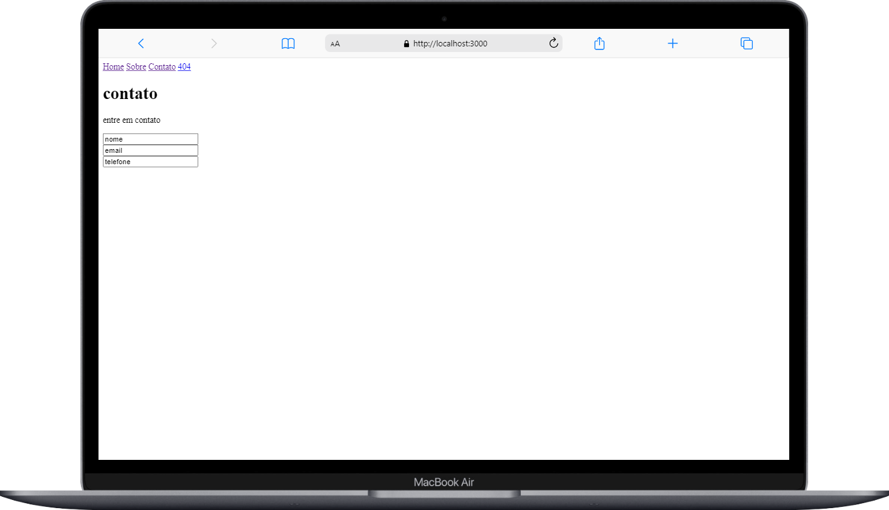

<h1 align="center">SPA(single-page application) - conceitos simples
</h1>

## 🚀 Tecnologias

Esse projeto foi desenvolvido com as seguintes tecnologias:

- HTML
- CSS
- JavaScript

## 💻 Projeto

uma pagina SPA com navegação somente pela navbar

## 🎓 Aprendizado

- package.json
- router
- pages
- uso de class
- polimorfismo
- uso do fetch e then

## ℹ️ sobre
estudar os conceitos base de uma aplicação SPA
Esse projeto foi feito apartir do aprendizado do curso Explorer da rocketseat

## imagens do projeto

 

